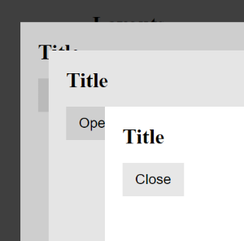

# qing-overlay (WIP)



[](https://github.com/mgenware/qing-overlay/actions)
[](https://github.com/mgenware/qing-overlay/actions)
[](https://npmjs.com/package/qing-overlay)
[](https://nodejs.org/en/)

**This component is not production-ready due to [this issue](https://github.com/whatwg/fullscreen/issues/124).**

An overlay component based on the `<dialog>` element ([MDN](https://developer.mozilla.org/en-US/docs/Web/HTML/Element/dialog)).

## Demo

[Demo](https://mgenware.github.io/qing-overlay/)

## Installation

> qing-overlay is based on lit.

```sh
npm i qing-overlay lit
```

## Usage

### A minimal example

```html
<qing-overlay>
  <h2>Title</h2>
  <p>Hello world</p>
</qing-overlay>
```

### Overlay size

Overlay size is fully customizable. By default, height defaults to auto (fits content size), and width defaults to `100vw`. You can add custom CSS to fit your use case. Some examples:

```css
/** Example 1 **/
/** 80% of screen width on medium or large screens */
@media (min-width: 768px) {
  qing-overlay::part(dialog) {
    width: 80%;
  }
}

/** Example 2 **/
/** Auto width with min and max values on medium or large screens */
@media (min-width: 768px) {
  qing-overlay::part(dialog) {
    width: auto;
    max-width: min(100vw, 1000px);
    min-width: 400px;
  }
}

/** Example 3 **/
/** Fullscreen dialog with margins **/
qing-overlay::part(dialog) {
  width: calc(100vw - 1rem);
  height: calc(100vh - 1rem);
}
@media (min-width: 768px) {
  qing-overlay::part(dialog) {
    width: calc(100vw - 4rem);
    height: calc(100vh - 4rem);
  }
}
```

### Attributes

- `open`: `boolean` indicates whether the overlay is visible.
- `closeOnEsc`: `boolean` true if the overlay should be closed when Esc is down. Defaults to `false`.

### Events

- `overlay-open`: fires when an overlay is opened.
- `overlay-close`: fires when an overlay is closed.
- `overlay-dismiss`: fires when an overlay is being dismissed (still visible).
- `overlay-esc-down`: fires when ESC key is pressed.

### CSS Shadow Parts

- `dialog` the internal `<dialog>` element.

### CSS Variables

- `--overlay-backdrop-background` CSS background value of dialog backdrop.
- `--overlay-animation-duration` background fade-in animation duration.
